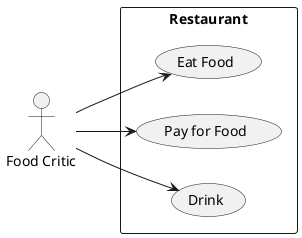

# Описание требований и архитектуры

## Введение
<!-- Общее краткое описание создаваемой системы -->
В рамках курса осуществляется проектирование решения на основе [постановки задачи от "заказчика"](../../task.md).

- [Описание требований и архитектуры](#описание-требований-и-архитектуры)
  - [Введение](#введение)
  - [Заинтересованные стороны](#заинтересованные-стороны)
  - [Бизнес-контекст (бизнес-требования)](#бизнес-контекст-бизнес-требования)
    - [Предпосылки](#предпосылки)
    - [Цели и задачи](#цели-и-задачи)
    - [Бизнес-цели](#бизнес-цели)
  - [Глоссарий](#глоссарий)
  - [Бизнес-метрики](#бизнес-метрики)
  - [Модель предметной области](#модель-предметной-области)
  - [Требования к системе](#требования-к-системе)
    - [Сценарии использования (Use case)](#сценарии-использования-use-case)
    - [Функциональные требования](#функциональные-требования)
    - [Нефункциональные требования/Требования к атрибутам качества](#нефункциональные-требованиятребования-к-атрибутам-качества)
    - [Ограничения](#ограничения)
  - [Архитектура](#архитектура)
    - [Журнал архитектурных решений](#журнал-архитектурных-решений)
    - [Контекст решения](#контекст-решения)
    - [Компонентная архитектура](#компонентная-архитектура)
    - [Реализация сценариев использования](#реализация-сценариев-использования)
    - [Программные интерфейсы](#программные-интерфейсы)
    - [Схема развертывания](#схема-развертывания)
  
## Заинтересованные стороны
<!-- Перечень заинтересованных сторон и их интересов по отношению к создаваемой системе. 
Подробнее: https://confluence.mts.ru/pages/viewpage.action?pageId=399975538 
-->
| Заинтересованная сторона   | Группа        | Интересы                                                                      | Заинтересованность | Влияние  |
|:---------------------------|:--------------|:------------------------------------------------------------------------------|:-------------------|:---------| 
| *Модератор входных заявок* | Модераторы    | Удобство при обработке большого объема входящих заявок                        | Низкая             | Высокое  |
| *Докладчик*                | Участники     | Скорость и простота подачи и обработка заявки на участие                      | Высокая            | Низкое   |
| *Online-Слушатель*         | Участники     | Простота регистрации, скорость и качество видео                               | Средняя            | Низкое   |
| *Offline-Слушатель*        | Участники     | Удобство регистрации и навигация по расписанию                                | Средняя            | Низкое   |
| *Ведущий конференции*      | Участники     | Получение исчерпывающей информации по всем докладам в быстром виде            | Низкая             | Среднее  |
| *Организатор конференции*  | Менеджмент    | Выполнение KPI от бизнеса по годовым целям                                    | Высокая            | Высокое  |
| *Менеджер по маркетингу*   | Менджмент     | Выполнение KPI от бизнеса по маркетинговым целям                              | Средняя            | Среднее  |
| *Инженер техподдержки*     | Сопровождение | Обеспечение работы системы                                                    | Низкая             | Низкое   |
| *Монтажер видео*           | Сопровождение | Интерфейс для загрузки готовых видео и встраивание их в отчет о конференциях  | Низкая             | Низкое   |
| *Видеооператор*            | Сопровождение | 

## Бизнес-контекст (бизнес-требования)
<!-- Общее описание бизнес-контекста создаваемой системы (автоматизируемой деятельности), список бизнес-целей заинтересованных сторон 
Подробнее: https://confluence.mts.ru/pages/viewpage.action?pageId=399973845
-->

### Предпосылки
Для крупной ИТ-компании участие и организация технических конференций становится правилом хорошего тона. Дополнительным бонусом является наличие собственных мощностей (платформы) для организации таких событий.

### Цели и задачи

* Развитие имиджа ИТ-компании
* Вовлечение талантливых специалистов в коммуникации для обмена опытом
* Развитие собственных сотрудников 
* Создание привлекательной площадки для рекламодателей

Система конференеций helloconf предназначена для управления подготовкой, организацией и проведением конференций для широкого круга аудитории. Конференции проводятся очно и предусматривают как online- так и offline-участие.
Все участники должны пройти предварительную регистрацию. Для авторов докладов - необходимо пройти процедуру предварительного
отбора и выбора тайм-слота для выступления.
В даты проведения конференции доступна онлайн-трансляции для стриминговой платформе WASD. После завершения конференции и монтажа - доклады доступны на одном из публичных видеохостингов.
Для рекламодателей доступно несколько уровней участия.

### Бизнес-цели

* От 10% докладчиков с каждой конференции получают оффер от кадровой службы
* Узнаваемость бренда повышена на 20% за пол года
* Рост количества зарегистрированных пользователей стриминговой платформы - как минимум на количство участников конференции
* Увеличение количества заявок на контекстную рекламу на 50% за пол года

## Глоссарий
<!-- Содержит основные понятия и термины предметной области  
Подробнее: https://confluence.mts.ru/pages/viewpage.action?pageId=375782595
-->
| Понятие                        | Сокращение                         | Определение                       |
|:-------------------------------|:-----------------------------------|:----------------------------------|
| Платформа конференций          | - | ПО, позволяющее организовать взаимодействие основых акторов: докладчиков, модераторов, посетителей и других |
| Докладчик                      | - | Участник конференции, который выступает с докладом на некоторую тему |
| Доклад                         | - | Доклад - тема, с которой выступает докладчик. Имеет краткое описание, назначенный тайм-слот, презентацию и после конференции оформляется в виде ролика |
| Посетитель                     | - | Участник, зарегистрированный как слушатель
| Заявка                         | - | Заявка на участив в конференции, имеет тип (докладчик, слушатель), статусную модель и workflow |
| Модератор сайта                | - | Принимает заявки, устанавливает контакт с докладчиком (если заявка на доклад) |
| Партнер                        | - | Участвует в конференции в качестве рекламодателя. Партнеры могут быть разных типов |
| Трансляция                     | - | Доклад транслируемый в режиме реального времени через стриминговую платформу |
| Ведущий                        | - | Модерирует мероприятие в реальном режиме времени - объявлеят доклады, следит за таймингом мероприятия

## Бизнес-метрики

* Количество конференций проведенных в год 
* Среднее количество докладчиков на конференцию
* Количество регистраций в качестве онлайн-слушателея
* Просмотры оффлайн-записей докладов через видео-платформу
* Прирост количества заявок за год 

## [Модель предметной области](data/data.md)

## Требования к системе

### Сценарии использования (Use case)
<!-- Подробное описание сценариев использования системы с привязкой к ролям участников и задействованным бизнес-сущностям 
https://confluence.mts.ru/pages/viewpage.action?pageId=375782108 
https://confluence.mts.ru/pages/viewpage.action?pageId=375782119 
-->
#### Диаграмма сценариев использования (Use Case Diagram) <!-- omit in toc -->

#### Список сценариев использования <!-- omit in toc -->

| ID     | Описание                                          |
|--------|---------------------------------------------------|
| UC.001 | *[Название сценария использования](uc/uc.001.md)* |

### Функциональные требования
<!-- Описание требований к функциям, реализуемым системой. Требование может быть привязано к сценарию использования или быть общим 
Подробнее: https://confluence.mts.ru/pages/viewpage.action?pageId=375782501 
-->
| ID     | Функциональное требование             |
|--------|---------------------------------------|
| FR.001 | Докладчик может регистрировать заявку на конференцию через браузер |
| FR.002 | Докладчик может отслеживать статус заявки через сайт Платформы и получать уведомления об измении статуса через SMS |
| FR.003 | Посетитель должен зарегистрирваться, указав свои основные данные, включая номер телефона |
| FR.004 | Посетитель может зарегистрировать для участия в online- и offline- форматах |
| FR.005 | Посетитель может просматривать темы выступления докладчиков, после их проверки модератором |
| FR.006 | Посетитель может получить ссылку на online-трансляцию заблоговременно |
| FR.007 | Посетитель получает входной билет и подтверждение своего offline-участия на email |
| FR.008 | Посетитель может оставить отзыв от докладе на сайте |
| FR.009 | Модератор должен иметь возможность просмотра и управлением поданными заявками |
| FR.010 | Модератор может добавлять к докладу дополнительные материалы, в том числе видео |
| FR.011 | Модератор должен иметь возможность отслеживать процесс коммуникации с докладчиком на этапе подготовки и одобрения доклада |
| FR.012 | Ведущий может просматривать расписания докладов и их основные сведения |

### Нефункциональные требования/Требования к атрибутам качества
<!-- Требования к основным архитектурным характеристикам (атрибутам качества) системы - надежность, масштабируемость, ИБ, и др.
Подробнее: https://confluence.mts.ru/pages/viewpage.action?pageId=375782530
-->
| ID     | Атрибут качества              | Описание требования                       |
|--------|-------------------------------|-------------------------------------------|
| QR.001 | Время жизни архив конференций | Прошедшие конференции сохранются и доступны для просмотра информации через порта в течении 5 лет |
| QR.002 | Площадка стриминга            | Система позволяет подключать альтернативные площадки для организации онлайн-трансляций |
| QR.003 | Площадка хранения видео       | Система позволяет подключать алтернативные площадки хранения записей выступлений |
| QR.004 | Доступность системы           | Онлайн-портал обеспечивает доступность 24/7 c 99% времени доступности за год |
| QR.005 | Производительность            | Система должна поддерживать до 1000 регистраций оффлайн посетителей и до 100k онлайн слушателей на одну конференцию |
| QR.006 | Безопасность                  | Персональные данные пользователей сохраняются согласно ГОСТ Р 59407-2021  |  
| QR.007 | Эффективность модерации       | Время между отправкой первоначальной заявки на участие в качестве докладчика и получением обратной связи - не более 2 дней |
| QR.008 | Скорость обработки видео      | Максимальное время появления видеоматериала на портале после окончания конференции - 3 дня |

### Ограничения
<!-- Описываются ограничения, оказывающие влияние на архитектуру системы - временные, финансовые, технологические
Подробнее: https://confluence.mts.ru/pages/viewpage.action?pageId=375782592
-->
| ID     | Ограничение            |
|--------|------------------------|
| AC.001 | *Описание ограничения* |

## Архитектура

### Журнал архитектурных решений
<!-- Записи о ключевых принятых архитектурных решениях (ADR) для реализации архитектурно-значимых требований.
Подробнее: https://confluence.mts.ru/pages/viewpage.action?pageId=421162308
-->
- [ADR.NNN Суть решения](adr/adr-template.md)

### [Контекст решения](context/context.md)

### [Компонентная архитектура](components/components.md)

### Реализация сценариев использования
<!-- Реализация сценариев использования на основе взаимодействия компонентов системы и внешних систем/участников.
Диаграммы последовательности (UML Sequence diagram) и текстовое описание.

Подробнее: 
https://confluence.mts.ru/pages/viewpage.action?pageId=399442132
https://confluence.mts.ru/pages/viewpage.action?pageId=399442170
-->
| ID     | Описание                          | Реализация                                    |
|--------|-----------------------------------|-----------------------------------------------|
| UC.001 | *Название сценария использования* | [Реализация сценария](uc-impl/uc.001-impl.md) |

### Программные интерфейсы
<!-- Спецификации публичных API системы и ее компонентов (синхронных, событийных). Создается на основе модели предметной области для реализации сценариев использования. 
  Форматы: OAS/Swagger, GraphQL, AsyncAPI/CloudEvents
-->
| Компонент             | Интерфейс                                      |
|:----------------------|:-----------------------------------------------|
| *Название компонента* | *[Название интерфейса](api/service-name.yaml)* |

### [Схема развертывания](deployment/deployment.md)
